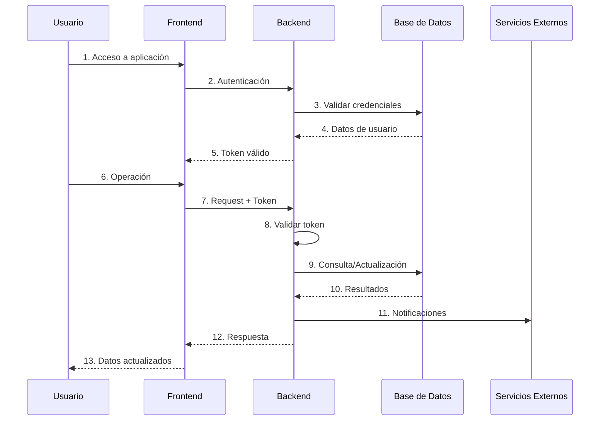
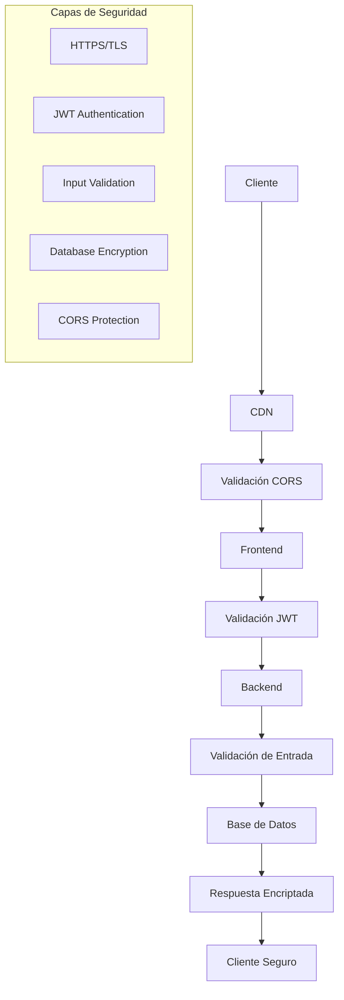

# Diagrama de Red - Arquitectura de Conectividad

## Diagrama de Flujo de Datos

## Configuración de Puertos

| Servicio | Puerto | Protocolo |
|----------|--------|-----------|
| Frontend | 443 | HTTPS |
| Backend Principal | 8080 | HTTPS |
| Backend Secundario | 443 | HTTPS |
| Base de Datos | 27017 | SSL/TLS |
| Servicios Externos | 443/587 | HTTPS/TLS |

## Flujo de Seguridad

## Características de Red

### Frontend
- **CDN Global**: Distribución de contenido
- **HTTPS Obligatorio**: Conexiones encriptadas
- **Auto-scaling**: Escalado automático

### Backend
- **Container-based**: Despliegue en contenedores
- **Auto-scaling**: Escalado según demanda
- **Load Balancing**: Distribución de carga
- **Health Checks**: Monitoreo continuo

