# Diagrama de Red - Arquitectura de Conectividad

## Diagrama de Red Principal

```mermaid
graph TB
    subgraph "Internet"
        Internet["🌐 Internet"]
    end

    subgraph "CDN / Edge Locations"
        CDN["📡 CDN Global<br/>Vercel Edge Network"]
    end

    subgraph "Frontend - Vercel"
        Vercel["Vercel Platform<br/>Global CDN"]
        Frontend["Kapo Main<br/>React SPA<br/>HTTPS Only"]
    end

    subgraph "Backend - Google Cloud"
        GCP["Google Cloud Platform<br/>South America East1"]
        
        subgraph "Cloud Run Service"
            Backend["Backend API<br/>Node.js + GraphQL<br/>Port: 8080<br/>HTTPS"]
        end
        
        subgraph "Container Registry"
            Registry["Container Registry<br/>gcr.io"]
        end
    end

    subgraph "Backend - Railway"
        Railway["Railway Platform<br/>Global"]
        
        subgraph "Railway Service"
            BackendOps["Backend Operaciones<br/>Node.js + GraphQL<br/>HTTPS"]
        end
    end

    subgraph "Base de Datos - AWS"
        AWS["AWS Global"]
        
        subgraph "MongoDB Atlas"
            MongoDB["MongoDB Atlas<br/>Cluster Replica Set<br/>SSL/TLS"]
        end
        
        subgraph "Atlas Regions"
            Primary["Primary Region<br/>South America"]
            Secondary["Secondary Region<br/>Backup"]
        end
    end

    subgraph "Servicios Externos"
        SMTP["SMTP Server<br/>Email Service"]
        WhatsApp["WhatsApp API<br/>Business API"]
        Redis["Redis Cloud<br/>Cache & Queues"]
    end

    subgraph "Monitoreo"
        Monitoring["Google Cloud Monitoring<br/>Logs & Metrics"]
        Arena["Bull Arena<br/>Queue Dashboard"]
    end

    %% Conexiones principales
    Internet --> CDN
    CDN --> Vercel
    Vercel --> Frontend
    
    Frontend -->|HTTPS/GraphQL| Backend
    Frontend -->|HTTPS/GraphQL| BackendOps
    
    Backend -->|MongoDB Driver<br/>SSL/TLS| MongoDB
    BackendOps -->|MongoDB Driver<br/>SSL/TLS| MongoDB
    
    Backend -->|SMTP/TLS| SMTP
    Backend -->|HTTPS API| WhatsApp
    Backend -->|Redis Protocol<br/>TLS| Redis
    
    Backend -->|Health Checks| Monitoring
    Backend -->|Queue Management| Arena
    
    %% Conexiones internas
    GCP --> Registry
    Registry --> Backend
    
    MongoDB --> Primary
    Primary --> Secondary

    %% Estilos
    classDef frontend fill:#e3f2fd,stroke:#1976d2,stroke-width:2px
    classDef backend fill:#f3e5f5,stroke:#7b1fa2,stroke-width:2px
    classDef database fill:#e8f5e8,stroke:#388e3c,stroke-width:2px
    classDef external fill:#fff3e0,stroke:#f57c00,stroke-width:2px
    classDef monitoring fill:#fce4ec,stroke:#c2185b,stroke-width:2px
    classDef network fill:#f1f8e9,stroke:#689f38,stroke-width:2px

    class Frontend frontend
    class Backend,BackendOps backend
    class MongoDB,Primary,Secondary database
    class SMTP,WhatsApp,Redis external
    class Monitoring,Arena monitoring
    class Internet,CDN,Vercel,GCP,Railway,AWS network
```

## Diagrama de Flujo de Datos

```mermaid
sequenceDiagram
    participant U as Usuario
    participant F as Frontend (Vercel)
    participant B as Backend (GCP)
    participant DB as MongoDB Atlas
    participant E as Servicios Externos

    U->>F: 1. Acceso a aplicación
    F->>B: 2. Autenticación JWT
    B->>DB: 3. Validar credenciales
    DB-->>B: 4. Datos de usuario
    B-->>F: 5. Token JWT válido
    
    U->>F: 6. Operación GraphQL
    F->>B: 7. Query/Mutation + JWT
    B->>B: 8. Validar token JWT
    B->>DB: 9. Consulta/Actualización
    DB-->>B: 10. Resultados
    B->>E: 11. Notificaciones (Email/WhatsApp)
    B-->>F: 12. Respuesta GraphQL
    F-->>U: 13. Datos actualizados
```



## Topología de Red Detallada


## Configuración de Puertos y Protocolos

| Servicio | Puerto | Protocolo | Descripción |
|----------|--------|-----------|-------------|
| Frontend (Vercel) | 443 | HTTPS | Aplicación React |
| Backend GCP | 8080 | HTTPS | API GraphQL Principal |
| Backend Railway | 443 | HTTPS | API GraphQL Operaciones |
| MongoDB Atlas | 27017 | SSL/TLS | Base de datos |
| Redis Cloud | 6380 | TLS | Cache y colas |
| SMTP | 587 | TLS | Envío de emails |
| WhatsApp API | 443 | HTTPS | Mensajería |

## Configuración de CORS

```mermaid
graph LR
    subgraph "Orígenes Permitidos"
        Localhost["localhost:*<br/>127.0.0.1:*<br/>Desarrollo"]
        Vercel["*.vercel.app<br/>Producción"]
        Custom["inacons.com.pe<br/>Dominio propio"]
        Apollo["studio.apollographql.com<br/>GraphQL Playground"]
    end

    subgraph "Headers Permitidos"
        Headers["Content-Type<br/>Authorization<br/>Accept<br/>Origin<br/>X-Requested-With"]
    end

    subgraph "Métodos Permitidos"
        Methods["GET<br/>POST<br/>PUT<br/>DELETE<br/>OPTIONS"]
    end

    Localhost --> Headers
    Vercel --> Headers
    Custom --> Headers
    Apollo --> Headers
```



## Flujo de Seguridad

```mermaid
graph TD
    A[Cliente] --> B[Vercel Edge]
    B --> C[Validación CORS]
    C --> D[Frontend React]
    D --> E[Validación JWT]
    E --> F[Backend GraphQL]
    F --> G[Validación de Entrada]
    G --> H[MongoDB Atlas]
    H --> I[Respuesta Encriptada]
    I --> J[Cliente Seguro]

    subgraph "Capas de Seguridad"
        K[HTTPS/TLS]
        L[JWT Authentication]
        M[Input Validation]
        N[Database Encryption]
        O[CORS Protection]
    end
```



## Monitoreo y Health Checks


## Descripción de Componentes de Red

### Frontend (Vercel)
- **CDN Global**: Distribución de contenido estático
- **HTTPS Obligatorio**: Todas las conexiones encriptadas
- **Edge Functions**: Procesamiento en el edge
- **Auto-scaling**: Escalado automático según demanda

### Backend (Google Cloud Run)
- **Container-based**: Despliegue en contenedores
- **Auto-scaling**: 0-10 instancias según carga
- **Load Balancing**: Distribución automática de carga
- **Health Checks**: Monitoreo continuo del servicio

### Base de Datos (MongoDB Atlas)
- **Cluster Replica Set**: Alta disponibilidad
- **SSL/TLS**: Conexiones encriptadas
- **Backup Automático**: Respaldo continuo
- **Monitoring**: Monitoreo 24/7

### Servicios Externos
- **SMTP**: Envío de emails con TLS
- **WhatsApp API**: Mensajería segura
- **Redis Cloud**: Cache distribuido

---

**Última actualización**: Diciembre 2024  
**Tipo de red**: Híbrida (Cloud + Edge)  
**Seguridad**: End-to-end encryption
