# Diagrama de Red - Arquitectura de Conectividad

## Diagrama de Red Principal

```mermaid
graph TB
    subgraph "Internet"
        Internet["🌐 Internet"]
    end

    subgraph "CDN / Edge"
        CDN["📡 CDN Global"]
    end

    subgraph "Frontend"
        Frontend["Aplicación Web<br/>React SPA<br/>HTTPS"]
    end

    subgraph "Backend Principal"
        Backend["API Principal<br/>Node.js + GraphQL<br/>HTTPS"]
    end

    subgraph "Backend Secundario"
        BackendOps["API Operaciones<br/>Node.js + GraphQL<br/>HTTPS"]
    end

    subgraph "Base de Datos"
        MongoDB["Base de Datos<br/>MongoDB Atlas<br/>SSL/TLS"]
    end

    subgraph "Servicios Externos"
        External["Servicios Externos<br/>Email, Mensajería, Cache"]
    end

    %% Conexiones principales
    Internet --> CDN
    CDN --> Frontend
    
    Frontend -->|HTTPS| Backend
    Frontend -->|HTTPS| BackendOps
    
    Backend -->|SSL/TLS| MongoDB
    BackendOps -->|SSL/TLS| MongoDB
    
    Backend -->|HTTPS| External

    %% Estilos
    classDef frontend fill:#e3f2fd,stroke:#1976d2,stroke-width:2px
    classDef backend fill:#f3e5f5,stroke:#7b1fa2,stroke-width:2px
    classDef database fill:#e8f5e8,stroke:#388e3c,stroke-width:2px
    classDef external fill:#fff3e0,stroke:#f57c00,stroke-width:2px
    classDef network fill:#f1f8e9,stroke:#689f38,stroke-width:2px

    class Frontend frontend
    class Backend,BackendOps backend
    class MongoDB database
    class External external
    class Internet,CDN network
```

## Diagrama de Flujo de Datos

```mermaid
sequenceDiagram
    participant U as Usuario
    participant F as Frontend
    participant B as Backend
    participant DB as Base de Datos
    participant E as Servicios Externos

    U->>F: 1. Acceso a aplicación
    F->>B: 2. Autenticación
    B->>DB: 3. Validar credenciales
    DB-->>B: 4. Datos de usuario
    B-->>F: 5. Token válido
    
    U->>F: 6. Operación
    F->>B: 7. Request + Token
    B->>B: 8. Validar token
    B->>DB: 9. Consulta/Actualización
    DB-->>B: 10. Resultados
    B->>E: 11. Notificaciones
    B-->>F: 12. Respuesta
    F-->>U: 13. Datos actualizados
```



## Configuración de Puertos

| Servicio | Puerto | Protocolo |
|----------|--------|-----------|
| Frontend | 443 | HTTPS |
| Backend Principal | 8080 | HTTPS |
| Backend Secundario | 443 | HTTPS |
| Base de Datos | 27017 | SSL/TLS |
| Servicios Externos | 443/587 | HTTPS/TLS |

## Flujo de Seguridad


## Características de Red

### Frontend
- **CDN Global**: Distribución de contenido
- **HTTPS Obligatorio**: Conexiones encriptadas
- **Auto-scaling**: Escalado automático

### Backend
- **Container-based**: Despliegue en contenedores
- **Auto-scaling**: Escalado según demanda
- **Load Balancing**: Distribución de carga
- **Health Checks**: Monitoreo continuo

### Base de Datos
- **Alta Disponibilidad**: Cluster replica set
- **SSL/TLS**: Conexiones encriptadas
- **Backup Automático**: Respaldo continuo

---

**Última actualización**: Diciembre 2024  
**Tipo de red**: Híbrida (Cloud + Edge)  
**Seguridad**: End-to-end encryption
