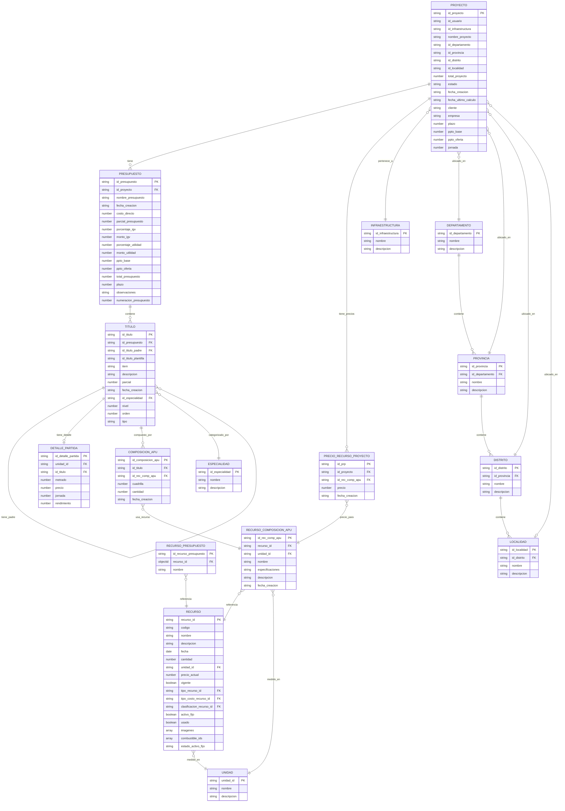

# Modelo Entidad-Relación - Sistema de Presupuestos

## Diagrama de Base de Datos

## Descripción de Entidades

### Entidades Principales

#### PROYECTO
- **Propósito**: Almacena información de proyectos de construcción
- **Clave Primaria**: `id_proyecto`
- **Relaciones**: Tiene múltiples presupuestos, ubicación geográfica, infraestructura

#### PRESUPUESTO
- **Propósito**: Presupuestos asociados a un proyecto
- **Clave Primaria**: `id_presupuesto`
- **Clave Foránea**: `id_proyecto` → PROYECTO
- **Cálculos**: Incluye costos directos, IGV, utilidad, totales

#### TITULO
- **Propósito**: Estructura jerárquica de títulos y partidas del presupuesto
- **Clave Primaria**: `id_titulo`
- **Clave Foránea**: `id_presupuesto` → PRESUPUESTO
- **Jerarquía**: Auto-referencia con `id_titulo_padre`
- **Tipos**: 'TITULO' o 'PARTIDA'

### Entidades de Detalle

#### DETALLE_PARTIDA
- **Propósito**: Detalles específicos de cada partida (metrado, precio, rendimiento)
- **Clave Primaria**: `id_detalle_partida`
- **Clave Foránea**: `id_titulo` → TITULO

#### COMPOSICION_APU
- **Propósito**: Composición de Análisis de Precios Unitarios (APU)
- **Clave Primaria**: `id_composicion_apu`
- **Clave Foránea**: `id_titulo` → TITULO

#### RECURSO_COMPOSICION_APU
- **Propósito**: Recursos que componen las APUs
- **Clave Primaria**: `id_rec_comp_apu`
- **Relaciones**: Referencia a RECURSO y UNIDAD

### Entidades de Soporte

#### RECURSO
- **Propósito**: Catálogo de recursos (materiales, mano de obra, equipos)
- **Clave Primaria**: `recurso_id`
- **Características**: Precios, especificaciones, clasificaciones

#### UNIDAD
- **Propósito**: Unidades de medida (m², m³, kg, etc.)
- **Clave Primaria**: `unidad_id`

#### ESPECIALIDAD
- **Propósito**: Clasificación de títulos por especialidad
- **Clave Primaria**: `id_especialidad`

### Entidades de Ubicación

#### DEPARTAMENTO, PROVINCIA, DISTRITO, LOCALIDAD
- **Propósito**: Estructura geográfica jerárquica
- **Jerarquía**: DEPARTAMENTO → PROVINCIA → DISTRITO → LOCALIDAD

## Relaciones Principales

1. **PROYECTO → PRESUPUESTO**: Un proyecto puede tener múltiples presupuestos
2. **PRESUPUESTO → TITULO**: Un presupuesto se estructura en títulos/partidas jerárquicas
3. **TITULO → TITULO**: Auto-referencia para crear jerarquías (padre-hijo)
4. **TITULO → DETALLE_PARTIDA**: Una partida tiene un detalle específico
5. **TITULO → COMPOSICION_APU**: Las partidas se componen de APUs
6. **COMPOSICION_APU → RECURSO_COMPOSICION_APU**: Las APUs usan recursos específicos
7. **RECURSO_COMPOSICION_APU → RECURSO**: Referencia al catálogo de recursos
8. **PROYECTO → PRECIO_RECURSO_PROYECTO**: Precios específicos por proyecto

## Índices Recomendados

- `PRESUPUESTO.id_proyecto` (para consultas por proyecto)
- `TITULO.id_presupuesto` (para consultas por presupuesto)
- `TITULO.id_titulo_padre` (para consultas jerárquicas)
- `COMPOSICION_APU.id_titulo` (para consultas de APUs por título)
- `PRECIO_RECURSO_PROYECTO.id_proyecto` (para consultas de precios por proyecto)
