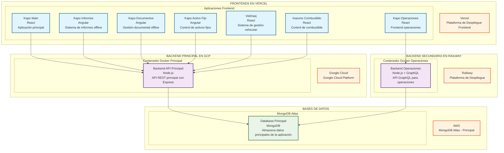
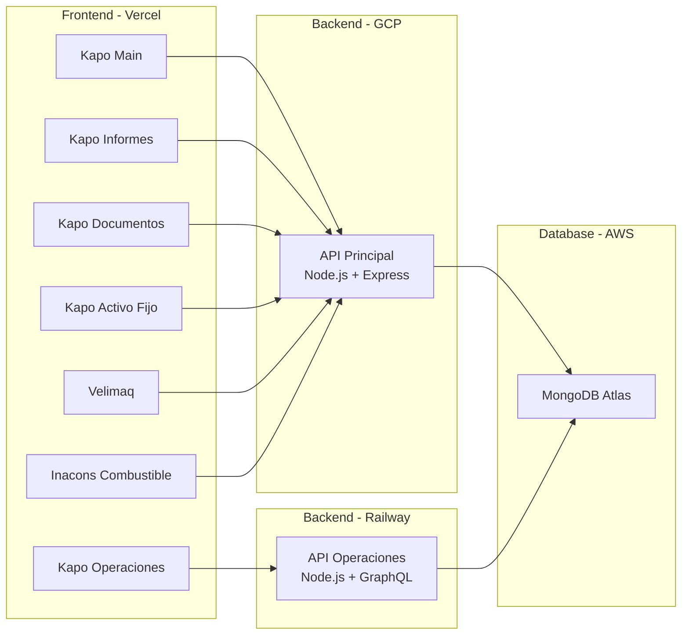

# Diagrama de Despliegue - Arquitectura Completa del Ecosistema

## Arquitectura General del modulo presupuesto

## Arquitectura Simplificada

## Descripción de Componentes

### Frontend (Vercel)
- **Kapo Main**: Aplicación principal desarrollada en React
- **Kapo Informes**: Sistema de informes offline en Angular
- **Kapo Documentos**: Gestión documental offline en Angular
- **Kapo Activo Fijo**: Control de activos fijos en Angular
- **Velimaq**: Sistema de gestión vehicular en React
- **Inacons Combustible**: Control de combustible en React
- **Kapo Operaciones**: Frontend de operaciones en React

### Backend Principal (GCP)
- **API Principal**: Node.js con Express para operaciones principales
- **Despliegue**: Contenedor Docker en Google Cloud Platform

### Backend Operaciones (Railway)
- **API Operaciones**: Node.js con GraphQL para operaciones específicas
- **Despliegue**: Contenedor Docker en Railway

### Base de Datos (AWS)
- **MongoDB Atlas**: Base de datos principal que almacena todos los datos de la aplicación

## Flujo de Datos

1. Los frontends se comunican con sus respectivos backends
2. Los backends procesan las solicitudes y acceden a la base de datos
3. La base de datos MongoDB Atlas almacena toda la información
4. Los datos se sincronizan entre los diferentes sistemas

## Tecnologías Utilizadas

- **Frontend**: React, Angular
- **Backend**: Node.js, Express, GraphQL
- **Base de Datos**: MongoDB Atlas
- **Despliegue**: Vercel, Google Cloud Platform, Railway
- **Contenedores**: Docker
