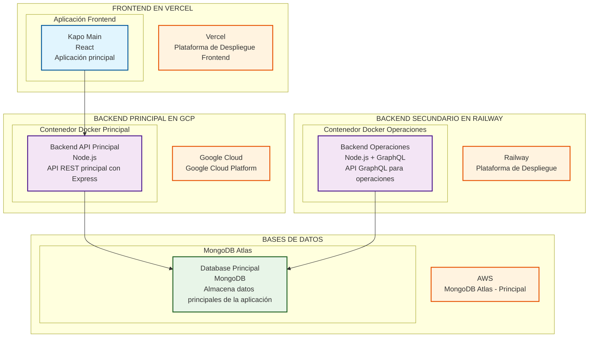
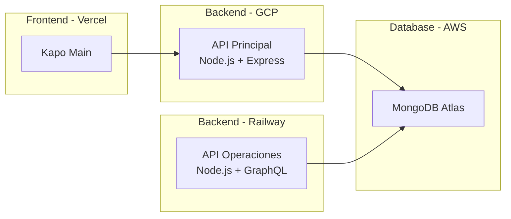

# Diagrama de Despliegue - Arquitectura Completa del Ecosistema

## Arquitectura General

## Arquitectura Simplificada

## Descripción de Componentes

### Frontend (Vercel)
- **Kapo Main**: Aplicación principal desarrollada en React

### Backend Principal (GCP)
- **API Principal**: Node.js con Express para operaciones principales
- **Despliegue**: Contenedor Docker en Google Cloud Platform

### Base de Datos (AWS)
- **MongoDB Atlas**: Base de datos principal que almacena todos los datos de la aplicación

## Flujo de Datos

1. El frontend se comunica con el backend principal.
2. Los backends procesan las solicitudes y acceden a la base de datos.
3. La base de datos MongoDB Atlas almacena toda la información.

## Tecnologías Utilizadas

- **Frontend**: React
- **Backend**: Node.js, Express, GraphQL
- **Base de Datos**: MongoDB Atlas
- **Despliegue**: Vercel, Google Cloud Platform, Railway
- **Contenedores**: Docker
